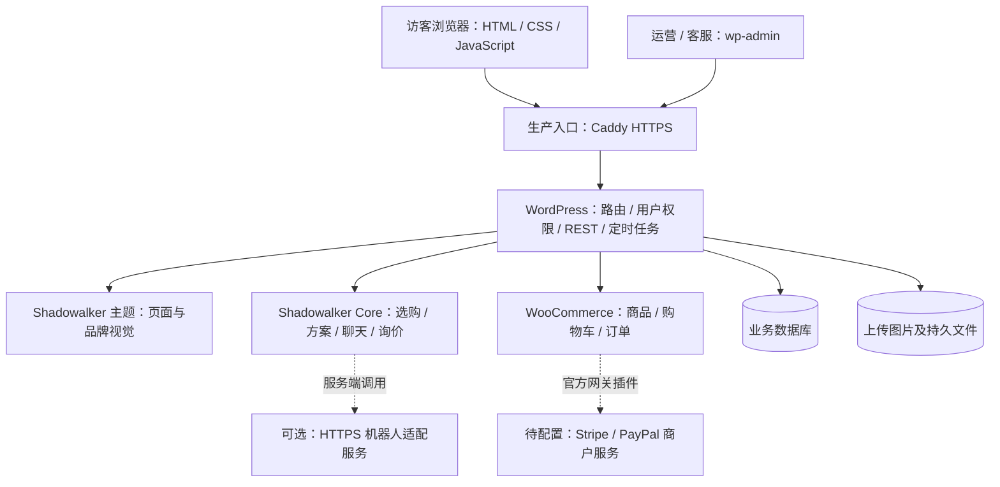
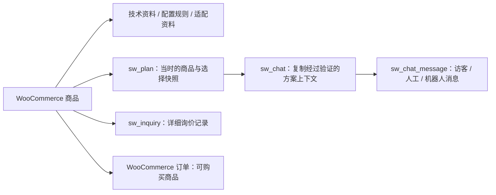
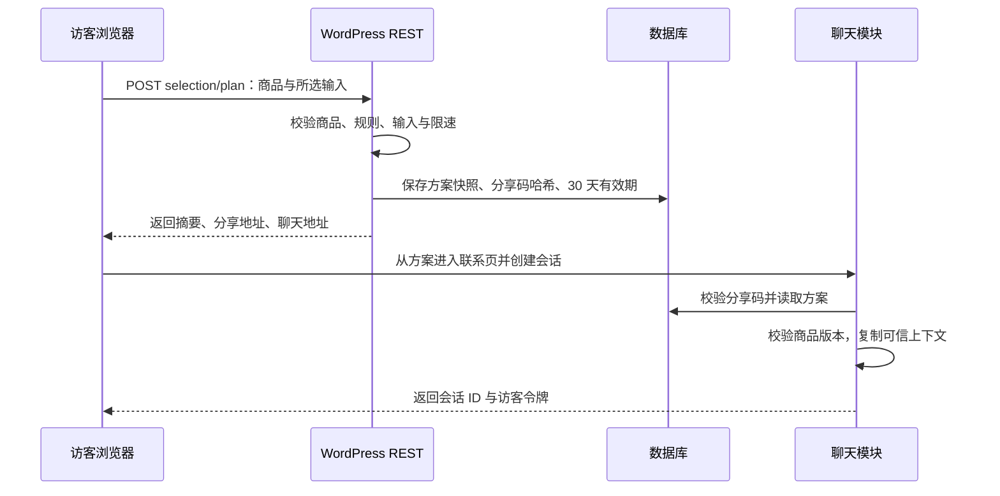
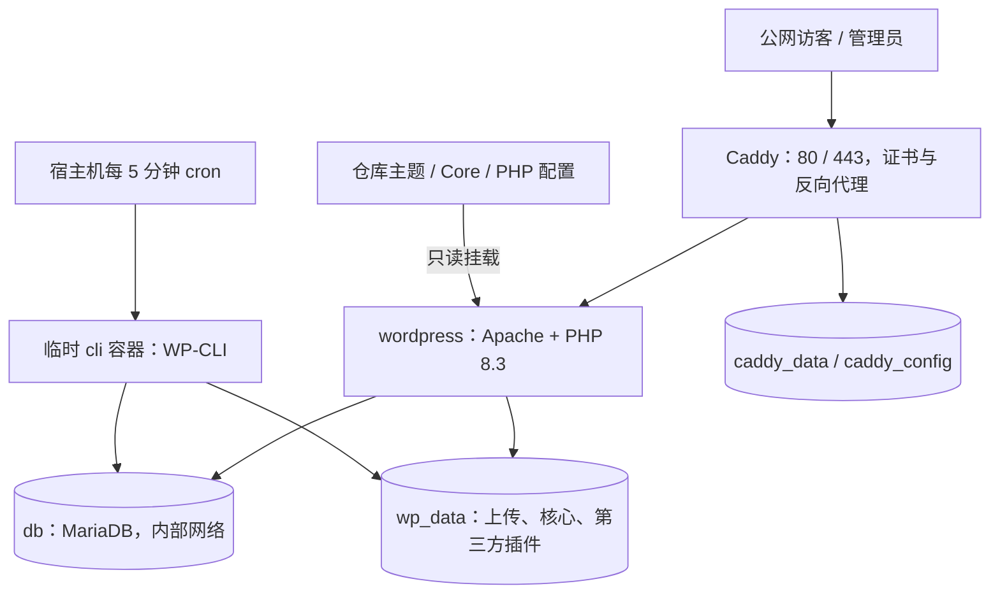

# Shadowalker 网站前后端架构详解

> 核验日期：2026-09-24。适用版本：Shadowalker 主题 / Core 插件 1.3.1；代码基线 `5756c49f7183f96d22de2db3050b1f2329fe6eed`。本文根据仓库源码、部署配置、测试和本地运行环境整理，描述当前实现；“待接入”“建议”不代表已经交付或上线。

## 1. 先了解整个系统

目前采用 **WordPress + WooCommerce 的一体化 PHP 架构**。浏览器访问 WordPress，服务器用主题模板生成页面；页面里的原生 JavaScript 再通过同站 REST 接口处理聊天和方案保存。后台直接使用 WordPress 管理界面。

可以把系统分为四部分：

1. **Shadowalker 主题**：品牌首页、科技风视觉、导航、响应式布局、多语言价值主张和商城页面容器。
2. **Shadowalker Core 自研插件**：商品技术资料、询价限制、对比、配置、兼容性初筛、方案、在线聊天和后台客服。
3. **WooCommerce**：标准商品、购物车、结账、账户、订单、库存、税费和退款基础能力。
4. **运行基础设施与扩展**：PHP、数据库、文件存储、HTTPS，以及按需配置的支付、多语言、SEO 和机器人服务。

这不是前后端分别部署的 React/Vue 单页应用，也没有独立 Node.js 后端。Node.js / Playwright 用于浏览器测试，不是线上运行依赖。经典页面服务端渲染有利于初始内容呈现和 SEO；WordPress 的主题与插件机制便于运营人员管理内容。



图中的 Caddy 是提供的生产部署方案；当前 `127.0.0.1:8090` 本地预览并没有经过这套公网 HTTPS 链路。

## 2. 当前运行环境、仓库和生产方案的区别

| 层面 | 核验结果 / 配置 | 含义 |
|---|---|---|
| 本地预览 | PHP 8.3.33、WordPress 7.1.1、WooCommerce 11.1.1，端口 8090 | 用来开发和验收的实际运行副本 |
| 本地数据库 | SQLite，通过 `db.php` drop-in 加载 | SQLite 集成插件列表显示 inactive，不代表 drop-in 没有运行 |
| 本地自研模块 | Shadowalker 主题与 Core 1.3.1 | 当前功能实现版本 |
| 本地订单存储 | `woocommerce_custom_orders_table_enabled=yes` | 本地已启用 WooCommerce HPOS 订单表 |
| 本地支付 / 国际化 / SEO 扩展 | 未见 Stripe、PayPal、WPML、Yoast 激活 | 集成代码和安装脚本不等于本地已连接这些服务 |
| Docker 开发方案 | WordPress Apache / PHP 8.3 + MariaDB 11.4 + WP-CLI，默认端口 8080 | 仓库可复现的开发与验证环境 |
| Docker 生产方案 | 上述服务 + Caddy HTTPS + 宿主机定时任务 | 已提供配置，需要真实服务器、域名、账户和上线验收 |
| GitHub 仓库 | 自研主题、插件、脚本、测试、文档与部署文件 | 不包含完整 WordPress 安装、业务数据库、真实密钥或付费插件 |

以上版本是本次核验快照，不是最低版本或未来安装结果的保证。插件声明最低 WordPress 6.6 / PHP 8.2；项目验证环境使用 PHP 8.3。默认 Docker 镜像标签以及首次下载的第三方插件会变化，生产应固定经过验证的版本或镜像摘要。

本地目录对应关系：`work/WholeSaleWeb` 是交付源码；`work/runtime/wordpress` 是预览运行副本；`outputs` 存放交付压缩包和文档。修改源码、更新运行副本、推送 GitHub、部署到公网是四个不同动作。

## 3. 前端页面如何组织

### 3.1 页面、模板与数据来源

| 页面 / 常用路径 | 主要实现 | 数据来源与行为 |
|---|---|---|
| 首页 `/` | 主题 `front-page.php` | 品牌视觉、价值主张、分类入口、商品展示 |
| 商城 `/shop/`、产品分类 | WooCommerce 模板 + `woocommerce.php` | WooCommerce 商品与分类查询 |
| 商品 `/product/{slug}/` | WooCommerce 详情 + Core hooks | 商品价格、图片、技术资料、详情模块、询价 / 购买入口 |
| 对比 `/compare/` | `[shadowalker_compare]` | 2–3 款同类产品、参数差异、资料来源和直接咨询 |
| 配置 `/build/` | `[shadowalker_build]` | 后台定义的配置组选项、依赖和互斥规则 |
| 改装初筛 `/compatibility/` | `[shadowalker_fit]` | 商品适配资料与访客输入的尺寸、安装方式等 |
| 联系 `/contact/` | `page-contact.php` / Shadowalker Chat 模板 | 首先显示聊天，折叠区域提供详细询价表单 |
| 购物车、结账、账户 | WooCommerce 页面 | 原生交易与账户流程，支付依赖配置 |
| 品牌 / 配送 / 隐私等内容页 | `page.php` | WordPress 页面内容 |
| 文章、列表、搜索、404 | `single.php`、`index.php`、`404.php` | WordPress 查询与模板机制 |

路径是默认建站数据使用的路径。管理员可以修改页面别名；多语言页面的实际地址由 WordPress / WPML 决定，并不是另建一套前端路由服务。

### 3.2 样式、图片与交互

- `assets/css/store.css` 提供基础页面、商城、响应式和可访问性样式；`tech.css` 提供深色、青色点缀的科技视觉。
- `assets/js/store.js` 处理移动导航、Escape 关闭与焦点恢复。
- Core 的 `assets/selection.css/js` 负责选购工具；`assets/chat.css/js` 负责聊天界面。功能插件也包含自己的界面和短代码，不能将其理解为完全不含展示代码的“纯后端”。
- 主题的 `assets/photos/*.webp` 是本地保存的摄影素材，用于首页和演示占位；真实商品主图优先使用 WooCommerce 媒体资料。现有摄影不代表具体在售型号。来源见 [视觉与摄影说明](09-visual-direction.md)。
- 原 SVG 演示素材仍保留在 `assets/images`，当前主要视觉已使用摄影素材。
- 采用 WordPress 加载 CSS / JS 的机制，没有独立前端打包服务器。WooCommerce 自己的页面或区块可能加载其配套脚本。

### 3.3 品牌价值主张与语言

首页醒目位置展示：**人生来孤独，唯有影为永恒伴侣，行者心态不虚此生。**

该内容通过语言文本映射和 gettext 翻译参与页面渲染，英文、简中、德文、法文、西班牙文按语义表达。“行者”强调不惧艰险、坚持前行、活出此生价值，不作为交通方式或人物称谓直译。切换语言后由服务器输出对应文本，不依赖浏览器临时机器翻译。

## 4. 后端模块与职责

入口为 `wp-content/plugins/shadowalker-core/shadowalker-core.php`。插件在 WordPress 生命周期中注册业务钩子、短代码、数据类型和 REST 接口；没有独立监听端口。

| 文件 / 模块 | 职责 |
|---|---|
| `includes/products.php` | 技术规格、演示图片、商品询价模式、购买限制、价格和结构化数据调整 |
| `includes/selection-data.php` | 商品资料结构、字段规范化、类别与验证规则 |
| `includes/selection-admin.php` | WooCommerce 商品编辑页中的选购资料与规则维护 |
| `includes/selection.php` | 方案保存、读取、有效期、版本检查、REST 入口和过期清理 |
| `includes/selection-ui.php` | 对比 / 配置 / 初筛页面、详情模块、前端初始数据 |
| `includes/chat.php` | 匿名会话、访客消息、访问令牌、限速、机器人协议、清理任务 |
| `includes/chat-ui.php` | 聊天短代码、上下文与前端配置 |
| `includes/chat-admin.php` | 管理后台客服收件箱、查看消息和人工回复 |
| `includes/inquiries.php` | 详细询价表单、保存、邮件通知、防刷、隐私导出与删除 |
| `includes/seed.php`、`selection-seed.php` | 显式 WP-CLI 演示数据导入，仅命令行环境加载 |

主题 `functions.php` 仍包含语言链接、WooCommerce 支持和展示辅助函数，因此这里是按职责组织的 WordPress 模块架构，没有强行套用完全独立的 MVC 分层。商品和询价数据保存在数据库，更换主题不会自动删除这些资料；但新主题需要重新衔接页面、短代码和样式。

## 5. 数据库与文件存储

### 5.1 主要数据在哪里

`wp_` 以下仅作为表前缀示例，真实前缀由安装配置决定。自研插件通过 WordPress / WooCommerce API 读写数据，没有新增专用业务表。

| 数据 | 存储位置 | 管理方 |
|---|---|---|
| 文章、页面、附件、商品、商品变体 | `wp_posts`、`wp_postmeta` | WordPress / WooCommerce |
| 产品分类和分类关系 | terms / term_taxonomy / term_relationships 等表 | WordPress / WooCommerce |
| 账户与角色资料 | `wp_users`、`wp_usermeta` | WordPress |
| 设置、定时任务、临时限速计数、业务锁 | options / transient 机制 | WordPress / Core |
| 详细询价 | `sw_inquiry` 自定义内容类型 + 元数据 | Core |
| 分享方案 | `sw_plan` 自定义内容类型 + 元数据 | Core |
| 聊天会话 | `sw_chat` 自定义内容类型 + 元数据 | Core |
| 聊天消息 | `sw_chat_message`，`post_parent` 指向会话 | Core |
| 订单 | 本地 HPOS：`wp_wc_orders` 等订单专用表 | WooCommerce |
| 订单明细 | `wp_woocommerce_order_items`、`wp_woocommerce_order_itemmeta` | WooCommerce |
| 购物车会话 | WooCommerce 会话机制，通常使用 `wp_woocommerce_sessions` | WooCommerce |
| 上传图片 / 文件 | `wp-content/uploads` 文件 + 附件数据库记录 | WordPress |

HPOS 的关联表包括 `wp_wc_order_addresses`、`wp_wc_order_operational_data`、`wp_wc_orders_meta`。Core 已声明 HPOS 兼容；生产是否启用仍须检查 WooCommerce 设置，不能仅凭兼容声明判断。



上图表示业务关联，并不表示数据库外键约束。方案与聊天之间传递的是快照；删除聊天不会连带撤销原分享方案。

### 5.2 商品扩展字段

| 元数据键 | 用途 |
|---|---|
| `_sw_quote_only` | `yes` 表示必须询价，禁止直接购买 |
| `_sw_specs` | 兼容早期的“标签 \| 值”自由规格文本 |
| `_sw_profile` | 分品类结构化资料：kind、verified、source、version、values、content |
| `_sw_options` | 配置组选项及 requires / excludes / includes 规则 |
| `_sw_fit` | 改装初筛允许的轮径、叉端开档、电压、安装位置和刹车类型 |
| `_sw_demo`、`_sw_art` | 演示标记与素材标识 |

`_sw_profile.values` 包括座位数、功率 W、电池 Wh、电压 V、重量 / 载重 kg、陆地续航 km、水上续航海里、长度 / 吃水 m、轮径英寸、叉端开档 mm、建议身高 cm 等；按品类使用，缺失值不会当作 0。`axle_mm` 对应 Dropout spacing，即车架 / 前叉安装轮轴位置的间距，不是前后轮轴距。

`content` 包括亮点、适用场景、限制、随附内容、交付、保修与测试条件。资料设为已核验时要求来源和版本，且含续航值时要求测试条件；演示商品始终按未核验处理。这里的“核验”是运营资料状态，不等于第三方认证。

### 5.3 私有业务记录

| 类型 | 关键字段 | 访问方式 |
|---|---|---|
| `sw_plan` | `_sw_plan_hash`、`_sw_snapshot`、`_sw_expires` | 持分享码经业务函数读取；无公开列表 |
| `sw_chat` | `_sw_token`、`_sw_locale`、`_sw_product`、`_sw_selection`、`_sw_mode`、`_sw_expires`、`_sw_updated`、`_sw_unread` | 访客令牌或具备权限的后台客服 |
| `sw_chat_message` | 内容正文、`_sw_role`、`_sw_request`、父会话 ID | 通过会话接口或后台读取 |
| `sw_inquiry` | 表单正文、`_sw_email`、`_sw_consent_at`、`_sw_product_id`、`_sw_notification_sent` | 后台询价管理与按邮箱的隐私工具 |

方案、聊天、消息均不注册公开 WordPress REST 内容列表，也不能通过普通站内搜索读取。询价有专用后台列表。访问令牌保存哈希，但消息和询价正文不是端到端加密内容，数据库和备份仍需按业务隐私数据管理。

## 6. 两条销售链路

### 6.1 标准购买链路

可购买配件 / 商品 → WooCommerce 加入购物车 → 填写地址 → 计算配送与税费 → 已配置的支付网关 → 网关验证回调 → WooCommerce 更新订单 → 发货与售后。

商品、订单、库存和支付状态以 WooCommerce 及官方网关为准。Core 不自行存储银行卡资料，也不自制支付成功回调。当前真实商户、运费和税务规则仍需配置，演示价不能直接当作真实报价。

### 6.2 询价与配置链路

整车 / 船等询价商品 → 查看参数或对比 → 配置偏好 / 兼容初筛 → 保存方案 → 带方案进入聊天 → 人工确认真实规格、运费和报价。

`_sw_quote_only=yes` 会在服务端禁止购买，覆盖直接加入购物车及相关变体场景；价格展示为询价，并移除商品结构化数据中的报价 offers，避免把演示价格作为正式售卖承诺。

当前配置方案不是 WooCommerce SKU 组合报价器，不会自动匹配变体价格、占用库存、计算整车运输费用或直接创建正式订单。这部分仍由人工或后续业务集成完成。

## 7. 对比、配置、初筛与方案的完整流程

### 7.1 对比与前端选择

- 只允许 2–3 款同类别产品进行对比，支持只看差异；资料来源和版本持续可见。
- 产品选择器默认载入最多 200 个候选后进行品类筛选；已明确选中的有效商品会补入，避免因上限而丢失。
- 搜索框搜索当前已经载入的选择列表，不是全库全文检索服务。商品规模增大时，应改为服务端分页查询。
- 配置支持最多 6 个选项组，每组 1–10 个选项；服务端校验选项引用、依赖与互斥。浏览器的即时提示帮助选择，但不能替代服务端验证。

### 7.2 改装兼容初筛

核心维度是轮径、叉端开档、电压、前 / 后 / 中置安装和碟刹 / 圈刹。只有商品资料已核验且五项都明确满足条件，才给出初步匹配；存在已知冲突时为不匹配；缺失或未经审核的资料转人工确认。自行车品牌 / 型号供客服参考，不是自动适配数据库。

结果只是选型初筛，不等于安装施工许可、完整电气兼容或安全认证。

### 7.3 保存、分享与资料变更



保存方案时，服务端从当前商品构建快照，包括商品 ID、名称、SKU、品类、模式、资料版本、核验状态、数量、目的国，以及所选配置或初筛输入。浏览器不能通过伪造快照自行声明“已核验”。

商品名称、SKU、资料、配置和适配规则参与 revision 计算。读取旧方案时，当前 revision 不一致会标记 `stale`；旧的匹配结果会降为待确认。旧方案不会在后台编辑商品后悄悄变成一份新的正式承诺。

分享码为 128 位随机数的 32 位十六进制表示，数据库仅保存 SHA-256 哈希。`?plan=...` 地址具有持有即访问的性质：任何拿到完整地址的人都能查看方案。可见的 `SW-...` 简短参考编号不能单独用于获取方案，也不授予聊天访问权。

方案有效期为 30 天。过期、无效或商品已不再公开可用时不提供原方案读取。保存页面与接口不缓存；工具页面标记不收录。分享与下载是链接 / 文本功能，尚未生成正式 PDF 报价单。

### 7.4 浏览器存储范围

| 存储 | 保存什么 | 保留范围 |
|---|---|---|
| `localStorage`：`sw-compare-v1` | 最多 3 款商品 ID 和类别 | 当前浏览器，可跨页面使用；不是服务器账户收藏 |
| `sessionStorage`：`sw-selection-draft-v1:...` | 按语言 / 工具模式 / 商品区分的输入、时间和版本 | 当前标签页；恢复时校验 24 小时及资料版本 |
| `sessionStorage`：`shadowalker-chat-v1:...` | 会话 ID、访客令牌，按语言 / 商品 / 方案区分 | 当前标签页，不提供跨设备登录同步 |

编辑输入后旧方案结果会隐藏；保存中禁用重复操作。复制使用浏览器剪贴板能力，失败时提供可选中文本；下载通过浏览器生成文本文件。聊天未发送文本在当前页面失败重试时保留，但没有实现刷新后的消息草稿持久化。

## 8. 在线聊天与客服后台

### 8.1 访客与后台如何沟通

联系页直接打开聊天界面，允许访客在不先填写姓名邮箱的情况下发起会话。会话具有独立随机访问令牌；访客请求携带令牌，客服使用 WordPress 登录身份和权限访问后台。

访客提交消息后先入库，再尝试机器人处理。没有配置机器人时进入人工模式，后台客服可以阅读上下文并回复；访客也可主动转人工或删除当前会话。

前端在页面可见且会话有效时约每 6 秒轮询一次，读取该会话消息。当前是短轮询，不是 WebSocket 或流式推送；每次返回受条数限制的会话快照。后台客服界面需要刷新查看变化，没有实现坐席自动分配、在线人数、桌面推送或响应时限管理。

### 8.2 稳定性与有效期

- 消息正文上限 2,000 字符；会话最多 100 条消息。访客在接近上限时停止新增，给人工回复保留空间。
- 发送使用请求 ID 去重，网络重试复用同一 ID；服务端通过会话锁降低并发重复写入风险。
- 会话从创建起有效 30 天，不会因每次阅读自动永久续期。
- 访客删除会话时删除对应消息；过期数据通过 `sw_chat_cleanup` 清理。任务每天调度，单次按最多 100 个记录分批处理，必要时追加任务。
- 逻辑过期会立即拒绝访问，物理清理依赖定时任务实际运行；备份中的历史数据另按备份策略处理。

### 8.3 后台角色

人工客服操作要求 `manage_woocommerce` 或 `manage_options` 权限，并校验后台请求 nonce。管理员 / 符合权限的商店管理人员可查看消息和方案上下文，人工回复后进入人工模式。

没有为每位客服建立独立业务租户或会话归属规则。若未来需要外包客服只看分配给自己的会话，需要增加权限模型，不能直接把完整管理员账号交给所有坐席。

## 9. 机器人接入接口与边界

已有两种服务端扩展方式：

1. 在 WordPress 中注册 `sw_chat_bot_reply` filter，自定义回复逻辑。
2. 配置 `SW_CHAT_BOT_URL` 和 `SW_CHAT_BOT_KEY`，调用自建 HTTPS 机器人适配服务；若已有 filter，则优先走 filter。

HTTPS 方式以 POST 发送 JSON，使用 `Authorization: Bearer <服务端密钥>`。上下文包含会话 ID、语言、商品 ID、最近最多 20 条消息，以及经过服务端校验的选购方案上下文。不会把访客会话令牌或方案分享密钥当作模型上下文传出。

适配服务最小回复示例：

```json
{"reply":"已经收到您的配置需求，我们还需要确认目的国家和使用场景。"}
```

HTTP 调用只允许 HTTPS，不跟随重定向，超时 8 秒，响应体上限 16 KiB。回复应为有效的纯文本，最多 2,000 字符。失败、超时或无有效回复时，保留已提交的访客消息并降级人工。自定义 PHP filter 内部如访问外部服务，仍需自行遵守超时与错误处理约定。

**当前只是可接入的协议和业务衔接，不包含已上线的模型服务、知识库、向量检索、机器人服务商账户或自动订单操作能力。** 机器人调用发生在 PHP 请求内，没有独立任务队列或流式返回。后续应由适配层负责模型选择、商品知识检索、回复规则、服务审计和外部系统集成，密钥只能留在服务器。

## 10. 自研接口清单

下表路径统一以 `/wp-json/shadowalker/v1` 为前缀。接口返回 JSON；业务错误使用 WordPress REST 错误响应。详细字段和错误场景以对应 PHP 文件及 HTTP 测试为准。

| 方法与路径 | 输入 / 用途 | 权限边界 |
|---|---|---|
| `POST /selection/plan` | 商品、工具模式、所选输入；返回方案、摘要、分享及聊天地址 | 公开创建入口的 nonce / 来源检查与限速 |
| `POST /chat` | locale、product_id、可选 plan；创建会话，返回 ID / token | 同上；方案从服务器重新读取 |
| `GET /chat/{id}` | 获取会话状态和消息 | `X-Shadowalker-Token` |
| `POST /chat/{id}/messages` | text、request_id；提交访客消息 | 会话令牌、有效期、限速与去重 |
| `POST /chat/{id}/handoff` | 转人工 | 会话令牌与有效期 |
| `DELETE /chat/{id}` | 删除会话及消息 | 会话令牌与有效期 |

创建入口使用 `X-Shadowalker-Nonce`；如果带有 Origin，则按协议、主机、端口校验来源。登录态 REST 请求还需遵守 WordPress 的 `X-WP-Nonce` 机制。公开页面上的 nonce 是请求校验措施，不是访客身份认证；真正的会话读取权限由随机令牌控制。

其他请求不都走 REST：

- 详细询价：`POST /wp-admin/admin-post.php?action=sw_inquiry`，支持未登录访客，校验表单 nonce、字段、同意项、防刷和蜜罐。
- 人工回复：`POST /wp-admin/admin-post.php?action=sw_chat_reply`，要求后台登录、权限和 nonce。
- 方案读取：服务端通过工具页面的 `?plan=...` 加载，没有公开方案集合 REST 接口。
- 购物车、结账、账户、支付回调：使用 WooCommerce / 网关插件自己的入口，不属于 Core 的聊天接口。

## 11. 详细询价表单与通知

详细表单位于联系页折叠区域，是聊天之外的补充方式。收集姓名、邮箱、国家、数量、消息、同意项和可选商品；服务端校验后先保存 `sw_inquiry`，再通过 `wp_mail` 向管理员邮箱发送通知。

邮件失败不会丢失已入库记录，通知结果保存在 `_sw_notification_sent`。当前未接入邮件服务商或投递监控；生产需要配置 SMTP / 事务邮件并实际验证送达。

询价提供按邮箱关联的 WordPress 个人数据导出 / 删除支持。匿名聊天和方案没有强制绑定邮箱，不能据此承诺已经覆盖全站所有数据的一键邮箱导出；它们有各自的访问令牌、删除和到期机制。

## 12. 多语言、支付与 SEO 如何衔接

### 12.1 多语言与多币种

已提供英文源文案及简中、德文、法文、西班牙文 gettext 翻译包，并有 WPML 页面 / 分类链接、语言菜单和 WCML 货币切换集成。翻译源在仓库 `translations`，编译产物位于主题 `languages`。

完整多语言上线还需要安装和配置相应 WPML / WCML 扩展，关联翻译页面、商品、分类、属性、政策及结账邮件。没有激活 WPML 时，不会出现假装可用的全站语言切换。

`wpml-config.xml` 定义元数据翻译策略：询价标记等复制，部分展示文本翻译，结构化资料 / 配置使用 copy-once。copy-once 不是后续自动实时同步，源商品变更后需要复核译文及参数版本，防止不同语言资料漂移。

界面语言、收货国家、前台币种和商户结算币种是四个不同维度。切成德语并不会自动获得德国收款资格或自动配置当地税费。

### 12.2 在线支付

安装脚本准备官方 WooCommerce Stripe Gateway 和 WooCommerce PayPal Payments。实际能展示哪些国家常用方式，由商户主体、账户审核、交易币种、设备、客户地区及网关配置共同决定，不能在商户国家未确定时承诺所有方式均可用。

Shadowalker 复用官方网关的结账与签名验证机制；没有自研资金账户、清结算系统或卡号存储。真实交易上线前应完成沙盒下单、支付失败、重复通知、退款及订单状态核对，再配置正式账户。

### 12.3 SEO

已有服务端输出页面、语义化内容、WordPress 标题、WooCommerce Product 结构化数据，以及 Yoast 安装与配置文档。询价商品避免输出虚假报价 offers；方案 / 工具页面设置不收录和不缓存。

完整 sitemap、canonical、hreflang、语言页面、真实产品文案和媒体描述，需要通过 WordPress / SEO / 多语言插件及运营内容共同完成。演示环境默认禁止收录；上线前先清理演示内容，再审核开放索引。不能将“安装 SEO 插件”视为搜索排名保证。

当前没有独立分析平台、广告归因系统或自研 cookie 同意平台；是否接入需要根据实际运营范围另行设计。

## 13. 安全、缓存和数据生命周期

| 措施 | 当前做法 | 边界 |
|---|---|---|
| 匿名会话访问 | 256 位随机令牌，数据库保存 SHA-256 哈希，使用请求头传递 | 持有令牌即可访问；不要写入公开日志或页面 URL |
| 分享方案 | 随机分享码、哈希保存、30 天有效期 | 完整链接可转发，不是仅本人可见 |
| 服务端验证 | 商品状态、配置约束、输入长度、角色、权限和 nonce | 浏览器提示不代替后端验证 |
| 输出处理 | WordPress 清理 / 转义，聊天纯文本输出 | 新增富文本或附件需要重新设计检查 |
| 防刷 | transient 计数；IP 使用带盐摘要作为计数键 | 不是专业抗 DDoS 服务，计数也非严格原子计费 |
| 响应缓存 | 自研聊天 / 方案 REST 使用 private / no-store，工具页禁缓存 | 新增 CDN 时仍需显式排除动态路径 |
| 后台操作 | WordPress 账号、能力检查及 nonce | 未配置单独的企业 SSO / 多因素认证方案 |
| 定时清理 | `sw_chat_cleanup` 清理过期聊天及方案 | 停用插件会取消计划任务；停机期间不会物理删除 |

当前主要限速：创建聊天每 IP 每小时 12 次；保存方案每 IP 每小时 30 次；消息每会话每分钟 30 次且每 IP 每小时 120 次；读取每会话每分钟 120 次。详细询价每 IP 每小时 10 次，另有邮箱短时防重复提交。

反向代理后若所有请求的 `REMOTE_ADDR` 相同，访客可能共享限速额度。生产模板没有替运营者完成真实 IP 信任链配置；应在可信代理 / Web 服务器处配置，不能直接信任任意客户端传来的转发头。

聊天、联系页、选购工具、购物车、结账、账户，以及 WooCommerce 动态接口和网关回调不能套用不区分用户的整页缓存。尤其带 nonce 的页面，长期缓存可能造成提交失败。现阶段未部署 Redis、CDN 或整页缓存层。

访问令牌哈希不等于数据库内容加密。备份、邮件、日志和可能接入的机器人服务各有数据副本和保留周期，需要分别纳入运维与隐私管理。

## 14. 部署架构与资源

### 14.1 仓库提供的生产拓扑



- `wordpress` 默认镜像为 `wordpress:php8.3-apache`；数据库默认 `mariadb:11.4`。
- WordPress 主机端口只绑定 `127.0.0.1`，数据库不发布公网端口；公网由 Caddy 提供 HTTPS。
- `cli` 属于 tools profile，是安装 / 维护时临时运行的工具容器，不是常驻接口服务。
- 自研主题与 Core 从仓库只读挂载；第三方插件和上传文件在持久卷内维护。
- 生产配置设置 `WP_ENVIRONMENT_TYPE=production`、`FORCE_SSL_ADMIN=true`、`DISABLE_WP_CRON=true`，禁止后台直接编辑代码。
- 因关闭访客触发的 WP-Cron，宿主机必须定时执行到期任务；既影响自研清理，也影响 WooCommerce 相关计划任务。
- Caddy 配置含压缩、部分安全头和敏感路径拦截，但不是完整 WAF。容器健康检查不等于真实下单链路健康。

### 14.2 持久化与备份对象

| 对象 | 内容 | 备份要点 |
|---|---|---|
| `db_data` | 商品、订单、用户、配置、聊天、询价、方案 | 数据库一致性备份和恢复演练 |
| `wp_data` | WordPress、上传图片、第三方插件等 | 与数据库时间点协调，保留上传原文件 |
| 仓库代码 | 自研主题、Core、部署脚本 | Git 版本与已发布提交记录 |
| 环境配置 | 数据库密码、域名、机器人密钥等 | 独立受限保存，不进入 Git / 公开文档 |
| `caddy_data/config` | 证书与服务状态 / 配置 | 保护访问权限并纳入恢复流程 |

GitHub 推送只保存代码和文档，不会备份真实订单、聊天、图片或商户账户，也不会自动部署网站。当前没有持续部署流水线。

### 14.3 起步所需资源

可先按单台 Linux 服务器 2 vCPU / 4 GB 内存 / 50–80 GB SSD 作为部署评估起点，实际容量取决于图片、商品量、插件、访问量、聊天轮询和备份策略；这不是压力测试后的容量承诺。

正式运营还需要：域名与 DNS、异地备份空间、事务邮件服务、支付商户账户、相应多语言插件许可、真实商品图片 / 规格 / 政策，以及客服人员。启用机器人时另外需要适配服务运行资源和模型 / 知识库账户。具体步骤见 [部署文档](02-deployment.md)、[资源清单](06-resources.md) 和 [运维文档](07-operations.md)。

## 15. 开发、验证与发布流程

建议流程：修改自研源码 → 在隔离 WordPress 环境验证 → 提交 GitHub 分支 / PR → CI 验证 → 预发布验收 → 备份 → 部署指定提交 → 核对真实业务流程。

当前 GitHub Actions 在 push 和 pull_request 触发，使用 Ubuntu、PHP 8.3、Docker WordPress / MariaDB 环境：

| 检查 | 覆盖范围 |
|---|---|
| PHP 语法、翻译检查 | PHP 可解析，翻译目录与文本一致性 |
| Compose 配置验证 | 开发 / 生产配置可解析 |
| 安装及重复 seed | 安装流程和演示数据幂等性 |
| `integration.php` | 商品 / 询价等基础业务规则 |
| `manifesto.php` | 多语言价值主张 |
| `chat.php`、`chat-http.py` | 会话、权限、消息和 HTTP 行为 |
| `selection.php`、`selection-http.py` | 商品资料、规则、方案、版本与接口 |
| `http-smoke.py` | 页面基本可访问性 |
| `selection-ux-browser.cjs` | Chromium 下选购交互与浏览器状态 |

CI 保留容器日志和版本信息 7 天；它不会把代码发布到生产。本基线对应的 CI 已通过，但这不证明真实支付、邮件送达、外部 AI 服务或公网域名已经验收。

本地 SQLite 预览与 CI MariaDB 均有各自用途；上线数据库采用什么引擎，应在相同引擎的预发布环境复验。当前没有生产级负载测试、故障切换演练或多地域可用性承诺。

## 16. 已实现、需要配置、后续开发

| 能力 | 当前状态 | 下一步条件 |
|---|---|---|
| 科技风品牌展示与多语言价值主张 | 已实现 | 替换为最终品牌 / 产品内容 |
| 商品与标准交易基础 | WooCommerce 已集成 | 真实库存、配送、税费、支付及政策配置 |
| 询价商品购买限制 | 已实现 | 运营正确设置商品销售模式 |
| 参数、对比、配置、初筛、分享方案 | 已实现 | 完整且经审核的真实产品资料 |
| 匿名聊天和后台人工回复 | 已实现 | 安排客服与日常值守流程 |
| AI 机器人 | 服务端接口已预留 | 自建适配服务、模型 / 知识库和真实验证 |
| 全站五语言内容 | UI 翻译及 WPML 集成已准备 | 插件许可、安装、翻译内容与语言 SEO |
| 国家常用支付 / 多币种 | 官方插件安装与集成路径已准备 | 商户主体、账户资格、币种与渠道验收 |
| SEO | 基础结构与操作方案已准备 | 真实内容、索引策略、语言关联及上线检查 |
| 邮件通知 | 保存后调用 `wp_mail` | 邮件供应商与送达验证 |
| 生产 HTTPS 部署 | 模板与步骤已提供 | 服务器、域名、密钥、备份和实际部署 |
| CRM / ERP / 物流同步 | 未实现 | 根据具体系统设计接口 |
| 实时推送、坐席分配、客服通知 | 未实现 | 业务量增长后扩展 |
| 高可用、多节点、Redis、CDN、专用搜索 | 未实现 | 基于监控和容量评估逐项建设 |

当前架构适合先把品牌展示、产品询价和标准配件交易闭环做完整。下一阶段应优先解决真实商品资料、商户收款、全站翻译和客服运营；之后再根据实际负载考虑独立聊天消息表、增量拉取 / 推送、异步机器人任务、持久对象缓存和商品分页搜索。

## 17. 后续维护从哪里入手

| 想修改什么 | 优先位置 |
|---|---|
| 首页布局 / 价值主张呈现 | 主题 `front-page.php`、翻译源与语言包 |
| 颜色、间距、手机端布局 | 主题 `store.css`、`tech.css`；工具独立样式 |
| 产品图片 / 价格 / 库存 / 文案 | WordPress / WooCommerce 后台 |
| 技术参数 / 资料来源 / 适配规则 | 商品编辑页；规则结构见 `selection-data.php` |
| 配置依赖 / 保存方案 / 失效逻辑 | `selection.php`、`selection-data.php` |
| 对比和配置界面 | `selection-ui.php`、`assets/selection.js/css` |
| 聊天流程 / 访问控制 | `chat.php`、`chat-ui.php`、`assets/chat.js` |
| 客服后台 | `chat-admin.php` |
| AI 接入 | `sw_chat_bot_reply` 或 HTTPS 适配服务与服务器环境变量 |
| 多语言商品与页面 | WPML / WCML 后台、`wpml-config.xml` |
| 收款、运费和订单 | WooCommerce 与对应官方扩展后台 |
| 服务器、HTTPS、定时任务 | `compose*.yaml`、`deploy` 与宿主机运维配置 |

## 18. 源码与配套文档索引

- [主题源码](../wp-content/themes/shadowalker/)、[Core 插件源码](../wp-content/plugins/shadowalker-core/)
- [开发 Compose](../compose.yaml)、[生产 Compose](../compose.production.yaml)、[环境变量示例](../.env.example)
- [初始化脚本](../scripts/setup.sh)、[CI 配置](../.github/workflows/ci.yml)、[测试目录](../tests/)
- [早期开发记录](01-development.md)、[部署与迁移](02-deployment.md)、[多语言](03-localization.md)、[支付](04-payments.md)、[SEO](05-seo.md)
- [资源清单](06-resources.md)、[上线运维](07-operations.md)、[验证记录](08-verification.md)
- [摄影与视觉](09-visual-direction.md)、[聊天与机器人协议](10-chat-and-bot.md)、[选购工具](11-selection-tools.md)、[后续路线图](12-competitor-roadmap.md)

阅读建议：业务负责人先看第 1、2、6、16 节；开发接手看第 3–13、15、17 节；部署运维看第 2、13、14、15 节，并配合部署和运维专篇。
